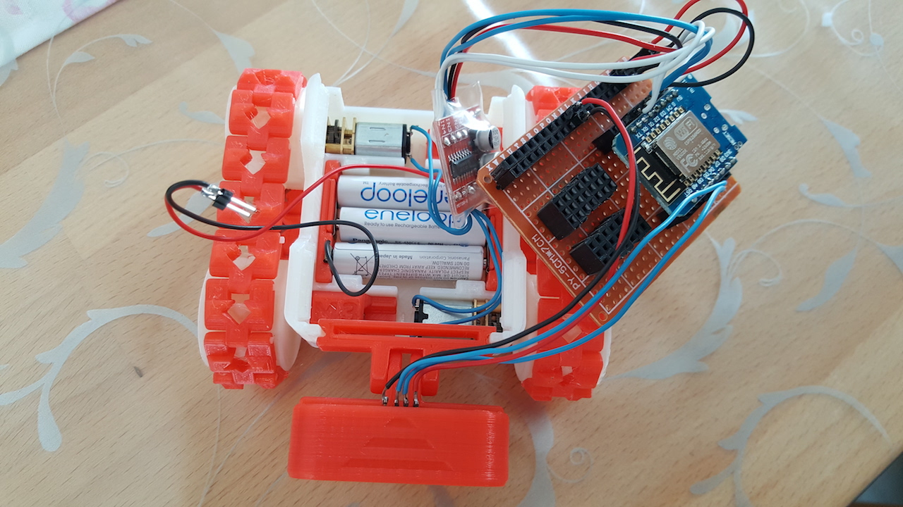
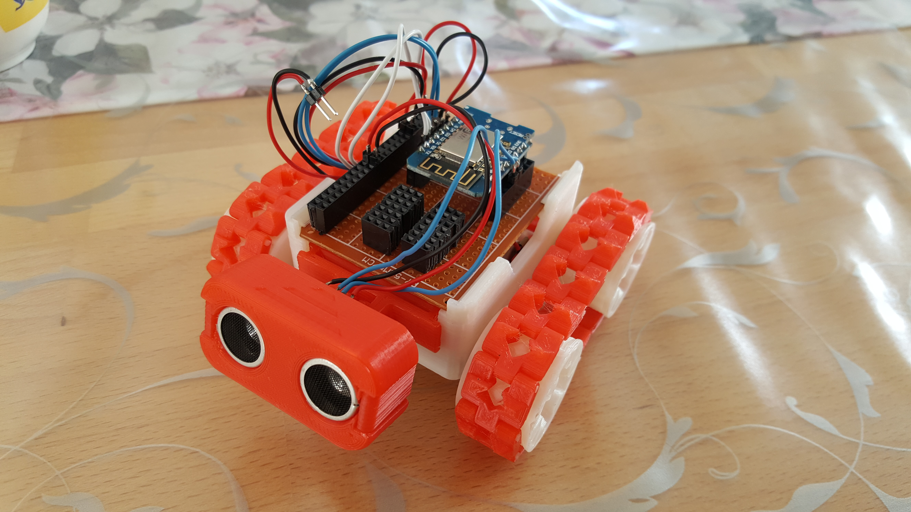

# SMARS on WiFi and Autonomous Mode

## General 
Arduino sketch to connect to your [SMARS modular robot]((https://www.thingiverse.com/thing:2662828)) via WiFi, control it via a simple web site served by the SMARS robot and let it drive autonomously using an Ultrasonic Senor (HC-SR04).

Details about the SMARS modular robot are available on Thingiverse, see [Smars modular robot](https://www.thingiverse.com/thing:2662828).

My SMARS is based on:
* the standard motors mentioned at Thingiverse,
* the [3 x AAA battery mod](https://www.thingiverse.com/thing:2762630) 
* a MX1508 2-channel DC motor driver
* a WEMOS D1 mini

## Configuration

WiFi:
* define `ACTIVATE_STATION_MODE` if you want to connect to an existing WiFi
* define `WIFI_SSID` and `WIFI_PASSWORD`, these settings are used for access point mode as well as for the station mode

Motors:
* use the `MOTOR_*` define statements to properly setup your motors

Ultrasonic Sensor:
* use `SENSOR_SONIC_TRIG_PIN` and `SENSOR_SONIC_ECHO_PIN` to setup the proper pins
* set `OBSTACLE_DISTANCE_IN_CM` to the required distance, when the SMARS should start avoiding obstacles

## Usage

After your SMARS has connected to your WiFi or you have connected to the SMARS' access point let your browser point to the IP address of your SMARS.

How to move it
* Press `AUTO` to let it drive autonomous, it will try to avoid obstacles by randomly turning left or right until no obstacle is in sight. If it is surrounded by obstacles it will stop moving. You can change `AUTOMODE_MAX_TURNCOUNT` in `automode.h`, to configure how many turns it should do before stopping. Press `AUTO` again to start over again.
* Press the arrows to move your SMARS when not in `AUTO` mode
* Press `STOP` to stop your SMARS, it will also disable the `AUTO` mode
* When driving in `AUTO` mode you can still press left and right arrows to change direction.

## Pictures

